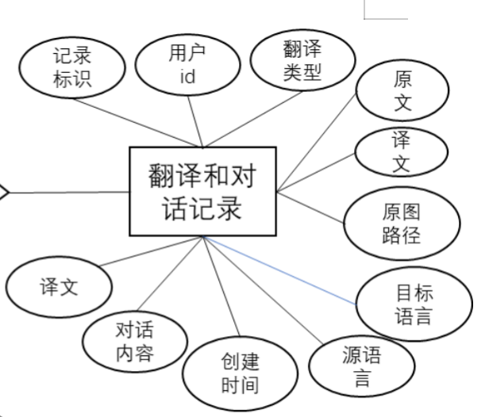
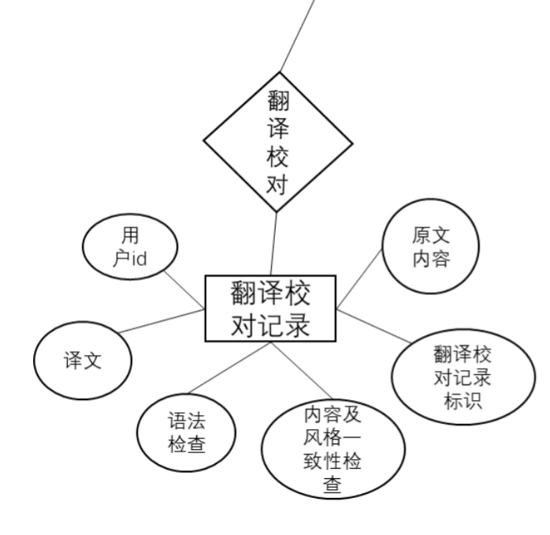

# 数据库设计说明书

## 1 引言

### 1.1 编写目的

- 本数据库设计说明书是关于**云译网翻译系统**的数据库设计，主要包括数据概念结构的设计、逻辑结构设计、物理结构设计以及数据字典、运行环境、安全设计等。
- 读者范围：用户、系统设计人员、系统开发人员、系统测试人员、系统维护人员。
- 本数据库设计说明书根据系统需求分析设计所编写。
- 为团队开发提供参考基础。

### 1.2 背景

- 随着自然语言处理（NLP）技术的飞速发展，基于 LLM 的应用逐渐成为主流。
  这些模型（如 OpenAI 的 GPT、Google 的 PaLM 等）已经展示出强大的语言生成
  和理解能力，能够处理多语言的翻译任务。传统的翻译软件如 Google Translate 或
  DeepL 虽然非常成熟，但依然有一些局限性，尤其是在复杂上下文、多义词、文化
  语境和口语化语言方面。
  目前，OCR 技术在识别印刷或手写的文字时非常有用，尤其在翻译文档、书籍、
  图片中的文字信息时尤为重要。

### 1.3 定义

- MongoDB: 相比于传统的 Mysql 数据库，MongoDB 有着更强大的**灵活性**，其JSON 文档结构能更自然地表示嵌套对象和数组，适合存储个性化翻译内容和用户反馈等复杂数据。用户模型、翻译记录等数据结构可能随业务变化而调整，MongoDB 的灵活性也使数据结构的改变更便捷


### 1.4 参考资料

- [1] 柳伟卫.Spring Boot 企业级应用开发实战[J].北京大学出版社,2018年3月

- [2] 杨开振.深入浅出springBoot2.x.[J/OL].人民邮电出版社,2018年8月

- [3] 《数据库设计说明书》国标规范文本

- [4] 《数据库系统概论》王珊，萨师煊编著

## 2 外部设计

### 2.1 标识符和状态

- User：用户(userInfo + termLibrary + feedback + loginRecords)
- Translate: 翻译和对话记录（Translation_Conversation_Records）
- Proofread: 翻译校对记录集合（Translation_Proofread_Records）

### 2.2 使用它的程序

- 数据库管理工具：pymongo

- 图形化数据库管理工具：MongoDB Compass

### 2.3 约定

- 操作系统：Ubuntu 

- 数据库版本：MongoDB Community Server 8.0.3

- 开发集成环境：PyCharm

### 2.4 专门指导

- 字符集采用utf8

- 排序规则用utf8_general_ci
- 按设计编辑字段名、类型、长度、不是null、键等
- 注意数据库名和表名的大小写

## 3 结构设计

1. 用户

    

2. 翻译和对话

   
3. 翻译评分

   

## 4 数据库设计
1. User
```json
{
  "_id": "ObjectId",                      // 用户在 MongoDB 中的唯一标识符
  "username": "String",                   // 用户名，添加唯一索引
  "password_hash": "String",              // 密码哈希值
  "email": "String",                      // 用户邮箱，添加唯一索引
  "created_at": "Date",                   // 注册时间
  "updated_at": "Date",                   // 最后登录时间
  "term_library": [                       // 用户的个性翻译记录，嵌套数组
    {
      "original_content": "String",       // 原文内容
      "translation": "String"             // 个性翻译内容
    }
  ],
  "feedbacks": [                          // 用户反馈嵌套数组
    {
      "feedback_text": "String",          // 反馈内容
      "created_at": "Date"                // 反馈时间
    }
  ],
  "login_records": [                      // 登录记录嵌套数组
    {
      "login_time": "Date",               // 登录时间
      "login_location": "location",        // 登录地点
      "logout_time": "Date"               // 登出时间
    }
  ]
}
```
- 通过将userInfo + termLibrary + feedback + loginRecords嵌套起来，避免跨集合(collection)查询
- 考虑为 email 或者 username 添加唯一索引，以防止重复注册

2. 翻译和对话记录（Translation_Conversation_Records）
```json
{
  "_id": "ObjectId",                      // 翻译记录的唯一标识符
  "user_id": "ObjectId",                  // 关联用户ID，引用 Users 集合
  "original_content": "String",           // 原文内容
  "translated_content": "String",         // 译文内容
  "dialogs": [                            // 多轮对话嵌套数组
    {
      "text": "String",                   // 对话内容
      "timestamp": "Date"                 // 时间戳
    }
  ],
  "original_language": "String",          // 原语言
  "target_language": "String",            // 翻译目标语言
  "created_at": "Date"                    // 创建时间
}
```
- 将翻译内容和对话内容进行结合，有利于大模型根据上下文来提供体验更好的翻译结果
- 将多轮对话 dialog 设计为嵌套数组，方便保存多轮对话信息
- 为 user_id 和 created_at 建立复合索引，优化查询效率

3. 翻译校对记录集合（Translation_Proofread_Records）
```json
{
  "_id": "ObjectId",                      // 校对记录的唯一标识符
  "user_id": "ObjectId",                  // 关联用户ID，引用 Users 集合
  "original_content": "String",           // 原文内容
  "translated_content": "String",         // 译文内容
  "proofread_time": "Date",               // 校对时间
  "checks": [                             // 校对内容的嵌套数组
    {
      "type": "String",                   // 检查类型，如 "grammar" 或 "content"
      "result": "String"                  // 检查结果，得分
    }
  ]
}
```

### 4.2 安全保密设计

1. 身份验证与授权
- 启用身份验证：确保 MongoDB 实例配置了用户身份验证 (auth=true)，要求每个用户通过用户名和密码访问数据库。
- 角色分离：为不同用户分配最低权限原则（Least Privilege Principle），比如只为数据库管理员提供管理权限，为开发者提供读写权限。
- 基于角色的访问控制 (RBAC)：MongoDB 支持 RBAC，分配不同角色（如 readWrite、dbAdmin、userAdmin 等），确保用户只能访问必要的数据。
- LDAP 集成：企业环境中可以通过 LDAP 进行用户集中管理，实现跨数据库的一致认证和授权。

2. 网络安全

- 启用 TLS/SSL 加密：确保客户端与 MongoDB 服务器之间的连接使用 TLS/SSL 加密，防止数据在传输过程中被窃取。
- 限制网络访问：使用防火墙、IP 白名单和 VPC 安全组规则，限制可以访问 MongoDB 实例的 IP 范围，避免暴露在公网环境中。
- 禁用未加密的连接：将 MongoDB 配置为仅接受加密连接，通过 net.tls.mode 设置为 requireTLS 强制客户端使用 TLS/SSL。

3. 数据加密

- 磁盘加密：在存储层启用磁盘加密（如 LUKS、BitLocker 或云服务的磁盘加密），以确保静态数据安全。
- 字段级加密：MongoDB 支持字段级加密，可以选择性地加密敏感字段数据，确保数据即使在数据库中也不明文存储。
- 客户端加密：使用 MongoDB 提供的客户端加密特性，可以在客户端应用程序中加密数据，这样即使数据库被入侵，数据也无法被解密。

4. 审计与监控

- 开启审计日志：MongoDB 提供审计日志功能，可以记录用户操作、数据访问和配置变更，有助于追踪潜在的恶意行为和误操作。
- 数据库监控：使用 MongoDB Ops Manager 或开源监控工具（如 Prometheus、Grafana）监控数据库性能、安全事件、以及潜在的异常活动。
- 日志分析：设置系统日志警报，当检测到不寻常的活动（如多个失败的身份验证尝试或未授权访问）时，及时报警并进行调查。

5. 数据备份与恢复

- 定期备份：定期备份 MongoDB 数据库，并在备份存储位置启用加密。
- 备份访问控制：确保只有授权人员可以访问备份文件，并定期测试恢复过程以防止灾难性数据丢失。
- 备份审计：记录备份操作，确保备份数据的完整性和可追溯性。

6. 安全配置

- 禁用 JavaScript 执行：MongoDB 支持服务器端的 JavaScript 执行，除非必须使用，建议禁用此功能 (security.javascriptEnabled=false) 以减少潜在的攻击面。
- 限制无密码访问：确保 MongoDB 没有未授权或默认用户账户，删除空密码用户。
